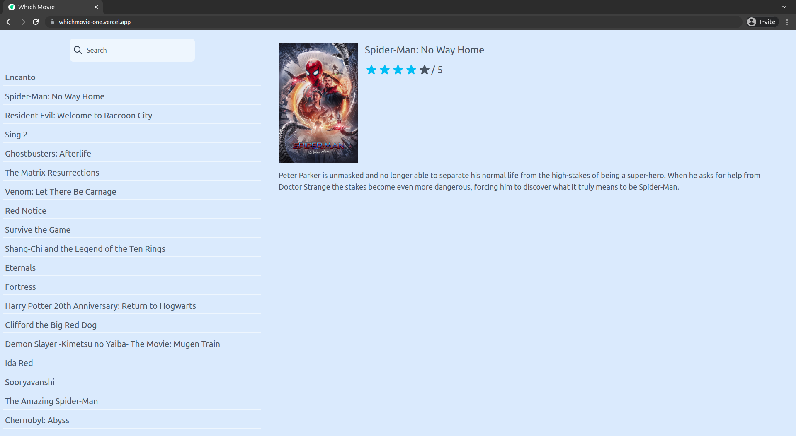

<div id="top"></div>

<!-- ABOUT THE PROJECT -->

## About The Project



## Getting Started

### Installation

1. Get a free API Key at [https://developers.themoviedb.org/3/getting-started/introduction](https://developers.themoviedb.org/3/getting-started/introduction)
2. Clone the repo
   ```sh
   git clone https://github.com/mhmdmrabet/whichmovie
   ```
3. Install NPM packages
   ```sh
   npm install
   ```
4. Enter your API in `src/api/utils.js`
   ```js
   const API_KEY = 'ENTER YOUR API';
   ```

### Launch the Project

```sh
npm run dev
```

<p align="right">(<a href="#top">back to top</a>)</p>

### Built With

- [React.js](https://reactjs.org/)
- [ViteJS](https://vitejs.dev/)
- [React Query](https://react-query.tanstack.com/)
- [TailwindCSS](https://tailwindcss.com/)
- [Toastify](https://fkhadra.github.io/react-toastify/introduction/)

<p align="right">(<a href="#top">back to top</a>)</p>

<!-- GETTING STARTED -->

<!-- USAGE EXAMPLES -->

## Usage

App allowing to search the details of a film.

<p align="right">(<a href="#top">back to top</a>)</p>

<!-- CONTACT -->

## Contact

M'rabet Mohamed - [@MrabetMohamed94](https://twitter.com/MrabetMohamed94) - mhmdmrabet@yahoo.fr

Project Link: [https://whichmovie-one.vercel.app/](https://whichmovie-one.vercel.app/)

<p align="right">(<a href="#top">back to top</a>)</p>
